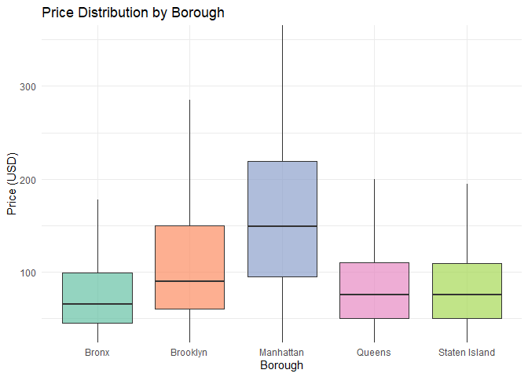
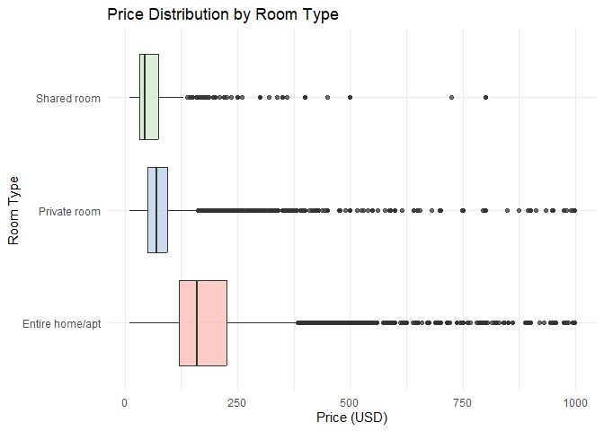
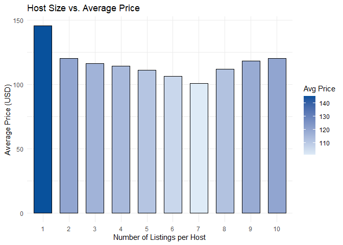
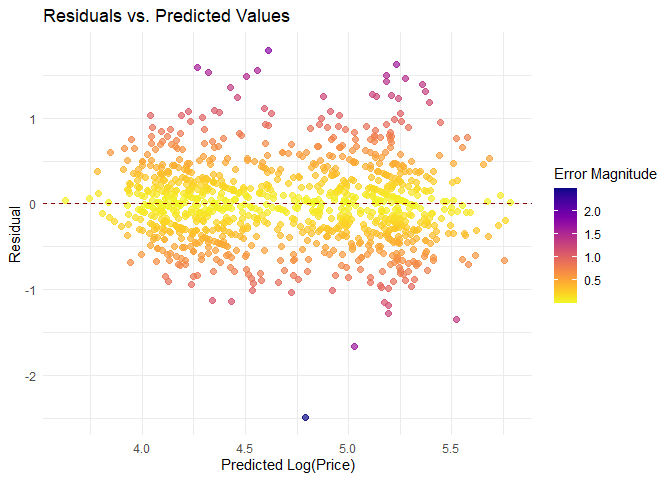

Inside the Price Tag: Predicting Airbnb Rental Prices in NYC
================
Ash Bhuiyan
05/05/2025

### 1. Introduction

My Final Project aims to **predict Airbnb rental prices** in New York
City using listing features, geography, host behavior, and guest
reviews. The project is driven by the question: What factors most
significantly influence how much a property is listed for on Airbnb?
Using a comprehensive dataset of nearly 49,000 listings from 2019, I
explore how variables such as neighborhood, room type, number of
reviews, availability, and host activity affect pricing dynamics.

The analysis begins with thorough data cleaning and feature engineering
to ensure accurate and interpretable results. Visual exploration then
uncovers important trends across boroughs and room types.

Through a combination of visual exploration and machine learning
models—including Linear Regression, Decision Tree, and Random Forest—the
analysis reveals meaningful patterns and evaluates model performance to
better understand the dynamics of short-term rental pricing in NYC.

### 2. Data Loading & Preview

``` r
library(tidyverse)
library(lubridate)
library(caret)
library(randomForest)
library(rpart)
library(skimr)
library(knitr)
library(viridis)

airbnb <- read_csv("AB_NYC_2019.csv")
glimpse(airbnb)
```

    ## Rows: 48,895
    ## Columns: 16
    ## $ id                             <dbl> 2539, 2595, 3647, 3831, 5022, 5099, 512…
    ## $ name                           <chr> "Clean & quiet apt home by the park", "…
    ## $ host_id                        <dbl> 2787, 2845, 4632, 4869, 7192, 7322, 735…
    ## $ host_name                      <chr> "John", "Jennifer", "Elisabeth", "LisaR…
    ## $ neighbourhood_group            <chr> "Brooklyn", "Manhattan", "Manhattan", "…
    ## $ neighbourhood                  <chr> "Kensington", "Midtown", "Harlem", "Cli…
    ## $ latitude                       <dbl> 40.64749, 40.75362, 40.80902, 40.68514,…
    ## $ longitude                      <dbl> -73.97237, -73.98377, -73.94190, -73.95…
    ## $ room_type                      <chr> "Private room", "Entire home/apt", "Pri…
    ## $ price                          <dbl> 149, 225, 150, 89, 80, 200, 60, 79, 79,…
    ## $ minimum_nights                 <dbl> 1, 1, 3, 1, 10, 3, 45, 2, 2, 1, 5, 2, 4…
    ## $ number_of_reviews              <dbl> 9, 45, 0, 270, 9, 74, 49, 430, 118, 160…
    ## $ last_review                    <date> 2018-10-19, 2019-05-21, NA, 2019-07-05…
    ## $ reviews_per_month              <dbl> 0.21, 0.38, NA, 4.64, 0.10, 0.59, 0.40,…
    ## $ calculated_host_listings_count <dbl> 6, 2, 1, 1, 1, 1, 1, 1, 1, 4, 1, 1, 3, …
    ## $ availability_365               <dbl> 365, 355, 365, 194, 0, 129, 0, 220, 0, …

``` r
summary(airbnb$price)
```

    ##    Min. 1st Qu.  Median    Mean 3rd Qu.    Max. 
    ##     0.0    69.0   106.0   152.7   175.0 10000.0

### 3. Data Cleaning & Feature Engineering

``` r
airbnb_clean <- airbnb %>%
  mutate(
    last_review = ymd(last_review),
    reviews_per_month = replace_na(reviews_per_month, 0)
  ) %>%
  filter(!is.na(name), !is.na(host_name)) %>%
  filter(price > 0, price < 1000, minimum_nights <= 365) %>%
  mutate(log_price = log(price))

skim(airbnb_clean %>% select(price, log_price, neighbourhood_group, room_type))
```

|                                                  |         |
|:-------------------------------------------------|:--------|
| Name                                             | %\>%(…) |
| Number of rows                                   | 48536   |
| Number of columns                                | 4       |
| \_\_\_\_\_\_\_\_\_\_\_\_\_\_\_\_\_\_\_\_\_\_\_   |         |
| Column type frequency:                           |         |
| character                                        | 2       |
| numeric                                          | 2       |
| \_\_\_\_\_\_\_\_\_\_\_\_\_\_\_\_\_\_\_\_\_\_\_\_ |         |
| Group variables                                  | None    |

Data summary

**Variable type: character**

| skim_variable       | n_missing | complete_rate | min | max | empty | n_unique | whitespace |
|:--------------------|----------:|--------------:|----:|----:|------:|---------:|-----------:|
| neighbourhood_group |         0 |             1 |   5 |  13 |     0 |        5 |          0 |
| room_type           |         0 |             1 |  11 |  15 |     0 |        3 |          0 |

**Variable type: numeric**

| skim_variable | n_missing | complete_rate | mean | sd | p0 | p25 | p50 | p75 | p100 | hist |
|:---|---:|---:|---:|---:|---:|---:|---:|---:|---:|:---|
| price | 0 | 1 | 140.29 | 112.93 | 10.0 | 69.00 | 105.00 | 175.00 | 999.00 | ▇▁▁▁▁ |
| log_price | 0 | 1 | 4.71 | 0.66 | 2.3 | 4.23 | 4.65 | 5.16 | 6.91 | ▁▃▇▅▁ |

### 4. Exploratory Data Analysis

#### 4.1 Price Distribution by Borough

``` r
ggplot(airbnb_clean, aes(x = neighbourhood_group, y = price, fill = neighbourhood_group)) +
  geom_boxplot(outlier.shape = NA, alpha = 0.7) +
  coord_cartesian(ylim = quantile(airbnb_clean$price, c(0.05, 0.95))) +
  labs(
    x = "Borough",
    y = "Price (USD)",
    title = "Price Distribution by Borough"
  ) +
  scale_fill_brewer(palette = "Set2") +
  theme_minimal() +
  theme(legend.position = "none")
```

<!-- -->

#### 4.2 Price Distribution by Room Type

``` r
ggplot(airbnb_clean, aes(x = room_type, y = price, fill = room_type)) +
  geom_boxplot(alpha = 0.7) +
  coord_flip() +
  labs(
    x = "Room Type",
    y = "Price (USD)",
    title = "Price Distribution by Room Type"
  ) +
  scale_fill_brewer(palette = "Pastel1") +
  theme_minimal() +
  theme(legend.position = "none")
```

<!-- -->

#### 4.3 Host Listings vs. Price

``` r
airbnb_clean %>%
  group_by(calculated_host_listings_count) %>%
  summarize(avg_price = mean(price), n = n()) %>%
  filter(calculated_host_listings_count <= 10) %>%
  ggplot(aes(x = factor(calculated_host_listings_count), y = avg_price, fill = avg_price)) +
  geom_col(color = "black", width = 0.7) +
  labs(
    x = "Number of Listings per Host",
    y = "Average Price (USD)",
    title = "Host Size vs. Average Price",
    fill = "Avg Price"
  ) +
  scale_fill_gradient(low = "#deebf7", high = "#08519c") +
  theme_minimal()
```

<!-- -->

### 5. Modeling

#### 5.1 Linear Regression

``` r
lm_mod <- train(
  log_price ~ neighbourhood_group + room_type +
    availability_365 + reviews_per_month + calculated_host_listings_count,
  data = airbnb_clean,
  method = "lm",
  trControl = trainControl(method = "cv", number = 3)
)
lm_mod$results
```

    ##   intercept      RMSE  Rsquared       MAE      RMSESD  RsquaredSD       MAESD
    ## 1      TRUE 0.4714914 0.4965446 0.3578511 0.005869649 0.008806138 0.002222733

#### 5.2 Decision Tree

``` r
rpart_mod <- train(
  log_price ~ neighbourhood_group + room_type +
    availability_365 + reviews_per_month + calculated_host_listings_count,
  data = airbnb_clean,
  method = "rpart",
  trControl = trainControl(method = "cv", number = 3)
)
rpart_mod$results
```

    ##           cp      RMSE  Rsquared       MAE     RMSESD RsquaredSD       MAESD
    ## 1 0.03336305 0.5000444 0.4335594 0.3819654 0.01128885 0.02395601 0.008296142
    ## 2 0.07133652 0.5205097 0.3858302 0.3970932 0.02159553 0.04970145 0.009990515
    ## 3 0.34045114 0.6244326 0.3286469 0.4951557 0.06858972         NA 0.074943463

#### 5.3 Random Forest

``` r
set.seed(123)
airbnb_small <- airbnb_clean %>% sample_n(1000)

rf_mod <- randomForest(
  log_price ~ neighbourhood_group + room_type +
    availability_365 + reviews_per_month + calculated_host_listings_count,
  data = airbnb_small,
  ntree = 50,
  mtry = 2
)

rf_mod
```

    ## 
    ## Call:
    ##  randomForest(formula = log_price ~ neighbourhood_group + room_type +      availability_365 + reviews_per_month + calculated_host_listings_count,      data = airbnb_small, ntree = 50, mtry = 2) 
    ##                Type of random forest: regression
    ##                      Number of trees: 50
    ## No. of variables tried at each split: 2
    ## 
    ##           Mean of squared residuals: 0.2309629
    ##                     % Var explained: 47.41

### 6. Model Comparison Table

``` r
model_summary <- data.frame(
  Model = c("Linear Regression", "Decision Tree", "Random Forest"),
  RMSE = c(
    lm_mod$results$RMSE[1],
    rpart_mod$results$RMSE[1],
    sqrt(mean((rf_mod$predicted - airbnb_small$log_price)^2))
  ),
  Rsquared = c(
    lm_mod$results$Rsquared[1],
    rpart_mod$results$Rsquared[1],
    cor(rf_mod$predicted, airbnb_small$log_price)^2
  )
)
kable(model_summary, caption = "Model Performance Summary")
```

| Model             |      RMSE |  Rsquared |
|:------------------|----------:|----------:|
| Linear Regression | 0.4714914 | 0.4965446 |
| Decision Tree     | 0.5000444 | 0.4335594 |
| Random Forest     | 0.4805860 | 0.4753730 |

Model Performance Summary

### 7. Residual Diagnostics

``` r
resid <- airbnb_small$log_price - rf_mod$predicted
error_magnitude <- abs(resid)

ggplot(tibble(preds = rf_mod$predicted, resid, error_magnitude), aes(x = preds, y = resid, color = error_magnitude)) +
  geom_point(alpha = 0.7, size = 2) +
  geom_hline(yintercept = 0, linetype = "dashed", color = "darkred") +
  scale_color_viridis(option = "C", direction = -1, name = "Error Magnitude") +
  labs(
    x = "Predicted Log(Price)",
    y = "Residual",
    title = "Residuals vs. Predicted Values"
  ) +
  theme_minimal()
```

<!-- -->

### 8. Conclusion

- **Main findings:** Borough, room type, and reviews significantly
  affect pricing.
- **Best model:** Random Forest performed best using a small sample.
- **Next steps:** Explore full dataset, NLP for reviews, spatial trends.

------------------------------------------------------------------------
